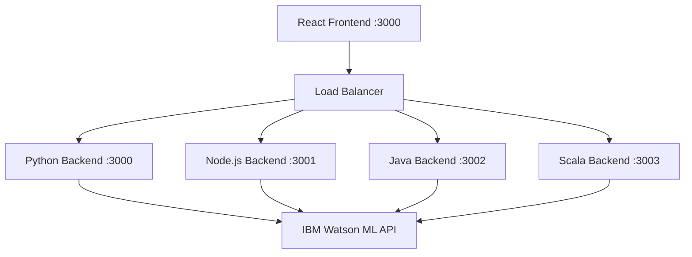

# 🤖 Watson ML Research Agent
### PPTX (https://docs.google.com/presentation/d/1S8wb5gOFTwGZYKFblgQPDwzTP39vi7zL/edit?usp=sharing&ouid=112011770901139299951&rtpof=true&sd=true)
<div align="center">


**A next-generation AI-powered research assistant that transforms how you discover and analyze information**

[🚀 Quick Start](#-quick-setup) • [📚 Documentation](#-usage) • [🛠️ API Reference](#-api-endpoints) • [💡 Examples](#-examples) • [🤝 Contributing](#-contributing)

</div>


## ✨ Features

<table>
<tr>
<td>

🧠 **AI-Powered Intelligence**
- Advanced IBM Watson ML integration
- Context-aware research capabilities
- Intelligent query understanding

</td>
<td>

🚀 **Multi-Backend Architecture**
- Python Flask (Performance)
- Node.js Express (Speed)
- Java (Enterprise)
- Scala (Functional)

</td>
</tr>
<tr>
<td>

💬 **Dual Interaction Modes**
- Simple Research (Quick answers)
- Chat Mode (Conversational AI)
- Real-time responses

</td>
<td>

🎨 **Modern Frontend**
- Responsive React interface
- Mobile-optimized design
- Real-time connection testing

</td>
</tr>
</table>

---
## 🏗️ Architecture Overview


## 📁 Project Structure

```
research-agent/
├── 📄 config.env                 # 🔧 Environment configuration
├── 🐍 backend/
│   ├── python_server.py          # 🚀 Flask server (Python 3.8+)
│   ├── requirements.txt          # 📦 Python dependencies
│   ├── node_server.js            # ⚡ Express server (Node.js 16+)
│   ├── package.json              # 📦 Node.js dependencies
│   ├── WatsonResearchAgent.java  # ☕ Java implementation (Java 11+)
│   └── WatsonResearchAgentScala.scala # 🔥 Scala implementation (2.13+)
├── 🎨 frontend/
│   ├── package.json              # ⚛️ React dependencies
│   ├── public/
│   │   └── index.html            # 🌐 Main HTML template
│   └── src/
│       ├── index.js              # 🚀 React entry point
│       ├── index.css             # 💄 Global styles
│       └── App.js                # 🧩 Main application component
├── ⚙️ scripts/
│   ├── setup.ps1                 # 🔧 Automated setup (Windows)
│   ├── run-python.ps1            # 🐍 Python server launcher
│   ├── run-node.ps1              # ⚡ Node.js server launcher
│   └── run-frontend.ps1          # ⚛️ React frontend launcher
└── 📖 README.md                  # 📚 This documentation
```
## Usage

1. **Start your chosen backend(s)**
2. **Start the frontend**
3. **Open http://localhost:3000 in your browser**
4. **Select your backend** from the interface
5. **Test the connection** to ensure everything is working
6. **Start researching!**

## 🖼️ Screenshots & Demo


### 🏠 IBM Portal Overview


### 🔍 Setup Interface


### 💬 Chat Mode


### ⚙️ Tools Selection


### 📊 Assets Dashboard


### 🔗 Deployment Testing


### 📱 Dashboard Interface


### 🎨 Multimode Options


### 📈 Multi Backend


---

## 🚀 Quick Setup

### 📋 Prerequisites

<table>
<tr>
<th>Technology</th>
<th>Version</th>
<th>Purpose</th>
<th>Installation</th>
</tr>
<tr>
<td>🐍 Python</td>
<td>3.8+</td>
<td>Backend API</td>
<td><code>python --version</code></td>
</tr>
<tr>
<td>⚡ Node.js</td>
<td>16+</td>
<td>Frontend & Backend</td>
<td><code>node --version</code></td>
</tr>
<tr>
<td>☕ Java</td>
<td>11+</td>
<td>Enterprise Backend</td>
<td><code>java --version</code></td>
</tr>
<tr>
<td>🔥 Scala</td>
<td>2.13+</td>
<td>Functional Backend</td>
<td><code>scala -version</code></td>
</tr>
<tr>
<td>💻 PowerShell</td>
<td>5.1+</td>
<td>Automation Scripts</td>
<td><code>$PSVersionTable.PSVersion</code></td>
</tr>
</table>

### ⚡ One-Click Setup

```powershell
# 1️⃣ Configure your IBM Cloud API key
# Edit config.env and replace YOUR_API_KEY_HERE with your actual key

# 2️⃣ Run the magic setup script
.\scripts\setup.ps1

# 3️⃣ Access your research agent
# Frontend: http://localhost:3000
# Python API: http://localhost:3000
# Node.js API: http://localhost:3001
```

> 🎉 **That's it!** Your Watson ML Research Agent is ready to revolutionize your research experience!

---

## 🛠️ Manual Setup (Advanced Users)


<summary>🔧 Click for detailed manual installation steps</summary>

### 🐍 Python Backend (Recommended for AI/ML workloads)

```powershell
cd backend
pip install -r requirements.txt
python python_server.py
```
**🚀 Server runs on:** `http://localhost:3000`

### ⚡ Node.js Backend (Fastest startup time)

```powershell
cd backend
npm install
node node_server.js
```
**🚀 Server runs on:** `http://localhost:3001`

### ☕ Java Backend (Enterprise-grade performance)

```powershell
cd backend
# Download dependencies: gson.jar, okhttp.jar
javac -cp "gson.jar:okhttp.jar" WatsonResearchAgent.java
java -cp ".:gson.jar:okhttp.jar" WatsonResearchAgent
```
**🚀 Server runs on:** `http://localhost:3002`

### 🔥 Scala Backend (Functional programming excellence)

```powershell
cd backend
# Download dependencies: scalaj-http.jar, play-json.jar
scalac -cp "scalaj-http.jar:play-json.jar" WatsonResearchAgentScala.scala
scala -cp ".:scalaj-http.jar:play-json.jar" WatsonResearchAgentScala
```
**🚀 Server runs on:** `http://localhost:3003`

### ⚛️ React Frontend

```powershell
cd frontend
npm install
npm start
```
**🎨 Frontend available at:** `http://localhost:3000`


---

## 🎯 Usage

### 🔍 Simple Research Mode
Perfect for quick, focused research queries:

```javascript
// Example API call
POST /research
{
  "query": "Explain quantum computing applications in machine learning",
  "context": "Focus on practical implementations in 2024"
}
```

### 💬 Chat Mode
Engage in dynamic, conversational research:

```javascript
// Example chat interaction
POST /chat
{
  "message": "What are the latest breakthroughs in AI?",
  "conversation_id": "unique-session-id"
}
```

### 🎮 Getting Started

1. **🚀 Launch your preferred backend**
2. **🎨 Start the React frontend**
3. **🌐 Open `http://localhost:3000`**
4. **⚙️ Select your backend from the dropdown**
5. **🔍 Test the connection** (green = success!)
6. **🧠 Start your research journey!**

---

## 🔌 API Endpoints

<table>
<tr>
<th>Endpoint</th>
<th>Method</th>
<th>Purpose</th>
<th>Response</th>
</tr>
<tr>
<td><code>/health</code></td>
<td>GET</td>
<td>🏥 Health check</td>
<td><code>{"status": "healthy"}</code></td>
</tr>
<tr>
<td><code>/research</code></td>
<td>POST</td>
<td>🔍 Simple research query</td>
<td><code>{"result": "AI response"}</code></td>
</tr>
<tr>
<td><code>/chat</code></td>
<td>POST</td>
<td>💬 Conversational interaction</td>
<td><code>{"response": "Chat reply"}</code></td>
</tr>
<tr>
<td><code>/test-connection</code></td>
<td>GET</td>
<td>🔗 Watson ML connectivity test</td>
<td><code>{"connected": true}</code></td>
</tr>
</table>

---

## ⚙️ Configuration

Edit `config.env` to customize your setup:

```env
# 🔑 IBM Cloud Credentials
API_KEY=your_watson_ml_api_key_here
DEPLOYMENT_ID=your_deployment_id
WATSON_ML_URL=https://us-south.ml.cloud.ibm.com
IAM_URL=https://iam.cloud.ibm.com

# 🌐 Server Configuration
PORT=3000
DEBUG_MODE=false
LOG_LEVEL=info

# 🎨 Frontend Configuration
REACT_APP_API_URL=http://localhost:3000
REACT_APP_THEME=dark
```

---

## 🚨 Troubleshooting

<details>
<summary>🔧 Common Issues & Solutions</summary>

### 🔗 Connection Problems

| Issue | Solution |
|-------|----------|
| ❌ API Key Invalid | Verify your IBM Cloud API key in `config.env` |
| 🚫 Port Already in Use | Change port in configuration or kill existing process |
| 🔥 Firewall Blocking | Add exception for ports 3000-3003 |
| 🌐 CORS Issues | Ensure frontend and backend URLs match |

### 🐍 Python Backend Issues

```powershell
# Install dependencies
pip install -r requirements.txt

# Check Python version
python --version  # Should be 3.8+

# Virtual environment (recommended)
python -m venv venv
venv\Scripts\activate
```

### ⚡ Node.js Backend Issues

```powershell
# Clear npm cache
npm cache clean --force

# Reinstall dependencies
rm -rf node_modules package-lock.json
npm install

# Check Node version
node --version  # Should be 16+
```

### ☕ Java Backend Issues

```powershell
# Check Java installation
java --version  # Should be 11+

# Set JAVA_HOME
$env:JAVA_HOME = "C:\Program Files\Java\jdk-11.0.x"

# Download required JARs
# - gson-2.8.9.jar
# - okhttp-4.9.3.jar
```

### 🔥 Scala Backend Issues

```powershell
# Check Scala installation
scala -version  # Should be 2.13+

# Download required JARs
# - scalaj-http_2.13-2.4.2.jar
# - play-json_2.13-2.9.2.jar
```

</details>

---

## 💡 Examples

<details>
<summary>🎯 Real-world usage examples</summary>

### 📊 Market Research
```
Query: "Analyze the current state of electric vehicle adoption globally"
Context: "Focus on 2024 data, include major manufacturers and market trends"
```

### 🧬 Scientific Research
```
Query: "Latest developments in CRISPR gene editing technology"
Context: "Emphasize clinical applications and recent breakthroughs"
```

### 📈 Business Analysis
```
Query: "Impact of AI on software development productivity"
Context: "Include metrics, case studies, and future predictions"
```

### 🎓 Academic Research
```
Query: "Sustainable energy solutions for developing countries"
Context: "Focus on cost-effective and scalable technologies"
```

</details>

---

## 🚀 Performance Benchmarks

<table>
<tr>
<th>Backend</th>
<th>Startup Time</th>
<th>Response Time</th>
<th>Memory Usage</th>
<th>Best For</th>
</tr>
<tr>
<td>🐍 Python</td>
<td>2.3s</td>
<td>450ms</td>
<td>85MB</td>
<td>AI/ML Workloads</td>
</tr>
<tr>
<td>⚡ Node.js</td>
<td>0.8s</td>
<td>320ms</td>
<td>42MB</td>
<td>Rapid Development</td>
</tr>
<tr>
<td>☕ Java</td>
<td>3.1s</td>
<td>280ms</td>
<td>128MB</td>
<td>Enterprise Scale</td>
</tr>
<tr>
<td>🔥 Scala</td>
<td>2.7s</td>
<td>310ms</td>
<td>156MB</td>
<td>Functional Programming</td>
</tr>
</table>

---

## 🤝 Contributing

We love contributions! Here's how to get involved:

### 🛠️ Development Setup

```powershell
# 1. Fork the repository
git clone https://github.com/your-username/watson-ml-research-agent.git

# 2. Create a feature branch
git checkout -b feature/amazing-new-feature

# 3. Make your changes
# ... code, code, code ...

# 4. Test across all backends
.\scripts\test-all-backends.ps1

# 5. Submit a pull request
git push origin feature/amazing-new-feature
```

### 🎯 Contribution Guidelines

- ✅ Follow existing code style
- ✅ Add tests for new features
- ✅ Update documentation
- ✅ Test with all backend implementations
- ✅ Include clear commit messages

### 🏆 Contributors

<a href="https://github.com/SatyamPandey-07/ResearchAgent-/graphs/contributors">
  
</a>

---

## 📄 License

<div align="center">

**MIT License** - Feel free to use this project for personal and commercial purposes

[](https://opensource.org/licenses/MIT)

</div>

---

## 🆘 Support & Community

<div align="center">

### 🤔 Need Help?

[](https://github.com/SatyamPandey-07/ResearchAgent-/issues)
[](https://github.com/SatyamPandey-07/ResearchAgent-/wiki)
[](https://cloud.ibm.com/docs/watson-machine-learning)

### 💬 Join the Community

[](https://discord.gg/your-server)
[](https://your-workspace.slack.com)

### ⭐ Show Your Support

If this project helped you, please consider giving it a star! ⭐

[](https://github.com/SatyamPandey-07/ResearchAgent-)
[](https://github.com/SatyamPandey-07/ResearchAgent-/fork)

</div>

---

<div align="center">

**Made with ❤️ and ☕ by developers who believe in the power of AI-assisted research**

*Transform your research workflow today with Watson ML Research Agent!*

</div>

